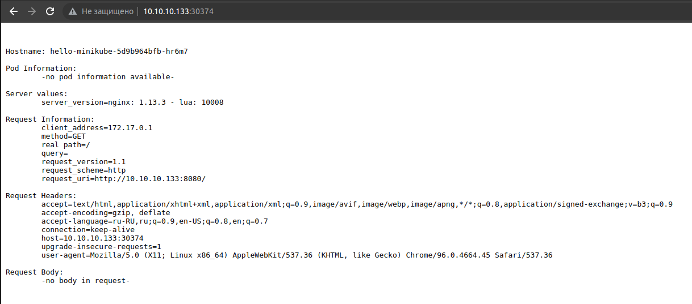
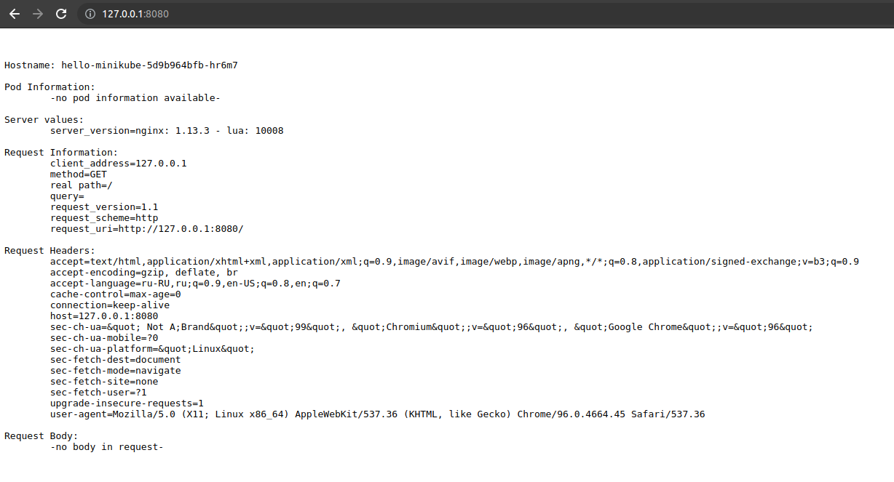

**1. Установка и настройка Minikube на виртуальном сервере, проверка версии и служб.**  

```
# minikube version  
minikube version: v1.24.0  
commit: 76b94fb3c4e8ac5062daf70d60cf03ddcc0a741b  
```

```
# minikube status  
minikube  
type: Control Plane  
host: Running  
kubelet: Running  
apiserver: Running  
kubeconfig: Configured  
```

```
# kubectl get pods --namespace=kube-system  
NAME                              READY   STATUS    RESTARTS       AGE  
coredns-78fcd69978-6lgfd          1/1     Running   0              72m  
etcd-worker1                      1/1     Running   6              73m  
kube-apiserver-worker1            1/1     Running   7              73m  
kube-controller-manager-worker1   1/1     Running   11 (73m ago)   73m  
kube-proxy-pp5q8                  1/1     Running   0              72m  
kube-scheduler-worker1            1/1     Running   7              73m  
storage-provisioner               1/1     Running   0              72m  
```

**2. Развертывание hello-minikube**


```
# kubectl create deployment hello-node --image=k8s.gcr.io/echoserver:1.4

# kubectl expose deployment hello-minikube --type=NodePort --port=8080

# minikube service hello-minikube --url
http://10.10.10.133:30374

```


Установка аддонов Ingress и Dashboard
```
# minikube addons enable ingress
    ▪ Using image k8s.gcr.io/ingress-nginx/kube-webhook-certgen:v1.1.1
    ▪ Using image k8s.gcr.io/ingress-nginx/kube-webhook-certgen:v1.1.1
    ▪ Using image k8s.gcr.io/ingress-nginx/controller:v1.0.4
🔎  Verifying ingress addon...
🌟  The 'ingress' addon is enabled

# minikube addons enable dashboard
    ▪ Using image kubernetesui/metrics-scraper:v1.0.7
    ▪ Using image kubernetesui/dashboard:v2.3.1
💡  Some dashboard features require the metrics-server addon. To enable all features please run:

	minikube addons enable metrics-server	


🌟  The 'dashboard' addon is enabled

# minikube addons enable metrics-server
    ▪ Using image k8s.gcr.io/metrics-server/metrics
```
  
**3. Установка kubectl на локальную машину**  

После установки kubectl копирую содержимое папки /root/.kube, а также файлы сертификатов ca.crt, client.key и client.crt. В файле /root/.kube/config правлю пути к сертификатам.

Проверяем доступность кластера:
```
$ kubectl cluster-info 
Kubernetes control plane is running at https://10.10.10.133:8443
CoreDNS is running at https://10.10.10.133:8443/api/v1/namespaces/kube-system/services/kube-dns:dns/proxy

To further debug and diagnose cluster problems, use 'kubectl cluster-info dump'.
```

Делаем перенаправление портов, проверяем доступность ресурсов:
```
$ kubectl port-forward hello-minikube-5d9b964bfb-hr6m7 8080:8080
Forwarding from 127.0.0.1:8080 -> 8080
Forwarding from [::1]:8080 -> 8080
Handling connection for 8080
Handling connection for 8080
```

