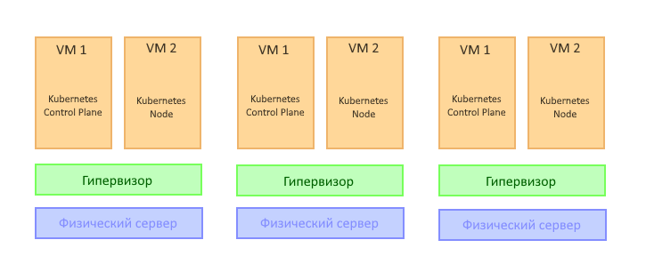

# Задание 1: Описать требования к кластеру  

Т.к. нам требуется отказоустойчивый кластер, то решено было строить его на трёх аппаратных серверах. Каждый сервер я расчитываю таким образом, чтобы он был нагружен не более, чем на 60%. Таким образом, при выходе из строя любого из них, нагрузка на 2 оставшихся не должна превысить 90%, что считаю приемлемым на время восстановительных работ.  
Для построения отказоустойчивого кластера Kubernetes нам требуется 3 рабочие ноды, а так же, по-хорошему, надо бы зарезервировать и control plane. Для этих целей Kubernetes я буду ставить не на "голое железо", а буду использовать прослойку в виде виртуализации. Схема изображена ниже на рисунке:

При расчёте требований и требований к отказоустойчивости, я заложил следующие положения:
- control plane будет в 3-х экземплярах, т.к. нам нужна отказоустойчивость;
- рабочих нод будет 3 экземпляра - это позволит нам как "размазать" нагрузку в случае выхода из строя оборудования;
- БД и кеш требуют по 100Гб дискового пространства;
- фронтенд и бэкенд занимают не более 1Гб дискового пространства;
- фронтенд требует 0,5 ядра;
- кластер состоит минимум из 3-х аппаратных серверов по 2 ВМ на каждой из них: 1 управляющая и 1 рабочая.

| Роль / ресурсы             | Ядра  | ОЗУ  | Диск | Реплик | Ядра | ОЗУ, МБ | Диск, Гб |
| -------------------------- | ----- | ---- | ---- | ------ | ---- | ------- | -------- |
| **Управляющая система**    |       |      |      |        |      |         |          |
| Гипервизор (vmWare ESXi)   | 2     | 4092 | 32   | 3      | 6    | 12228   | 96       |
| Kubernetes Control plane   | 2     | 2048	| 50   | 3      | 6    | 6144    | 150      |
| Kubernetes node            | 1     | 1024 | 100  | 3      | 3    | 3072    | 300      |
| **Приложение**             |       |      |      |        |      |         |          |
| База данных                | 1     | 4096 |      | 3      | 3    | 12288   |          |
| Кэш                        | 1     | 4096 |      | 3      | 3    | 12288   |          |
| Фронтенд                   | 0,1   | 50   |      | 5      | 0,5  | 250     |          |
| Бэкенд                     | 1     | 600  |      | 10     | 10   | 6000    |          |
| **Суммарное потребление**  |       |      |      |        | **31,5** | **52330**   | **546**      |

На данном этапе мы получили значения, необходимые для запуска всего нашего ПО. Вспомним, что для того, чтобы наш кластер и приложение оставались стабильны при выходе из строя одного из серверов, пересчитаем значения, приняв их за 60% от того, что нам нужно.

Получаем (округляя в большую сторону), что наши аппаратные сервера должны иметь: 53 ядра, 53Гб ОЗУ и 546Гб дискового хранилища

Теперь разделим полученные значения на 3 (по количеству серверов) и, опять же округляем до типовых значений, и получаем: 18 ядер, 32 Гб ОЗУ и 300 Гб дискового пространства. Нам потребуется 3 сервера с такими характеристиками.