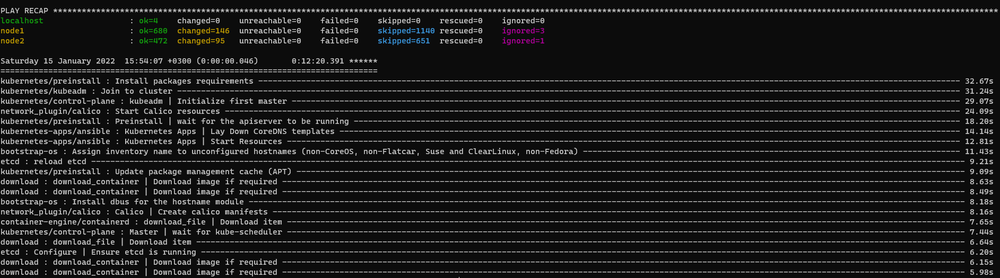

# Домашнее задание к занятию "12.4 Развертывание кластера на собственных серверах, лекция 2"

## 1. Подготовить инвентарь kubespray  

Для того, чтобы подготовить [инвентарь](kubespray/inventory/mycluster/), я:  
    - клонирую себе репозиторий: https://github.com/kubernetes-sigs/kubespray.git  
    - устанавливаю зависимости: sudo pip3 install -r requirements.txt  
    - Делаю копию стандартной конфигурации, правлю инвентарь  
    - Правлю конфгурацию, чтобы она удовлетворяла заданию (на самом деле не правлю, containerd и так стоит по-умолчанию)  

## 2. Подготовить и проверить инвентарь для кластера в YC

Развертываю на серверах YC. 
```
ansible-playbook -i inventory/mycluster/hosts.yaml -b cluster.yml

...

PLAY RECAP ***************************************************************************************************************************************************
localhost                  : ok=4    changed=0    unreachable=0    failed=0    skipped=0    rescued=0    ignored=0
node1                      : ok=680  changed=146  unreachable=0    failed=0    skipped=1140 rescued=0    ignored=3
node2                      : ok=472  changed=95   unreachable=0    failed=0    skipped=651  rescued=0    ignored=1

Saturday 15 January 2022  15:54:07 +0300 (0:00:00.046)       0:12:20.391 ******
===============================================================================
kubernetes/preinstall : Install packages requirements ------------------------------------------------------------------------------------------------ 32.67s
kubernetes/kubeadm : Join to cluster ----------------------------------------------------------------------------------------------------------------- 31.24s
kubernetes/control-plane : kubeadm | Initialize first master ----------------------------------------------------------------------------------------- 29.07s
network_plugin/calico : Start Calico resources ------------------------------------------------------------------------------------------------------- 24.09s
kubernetes/preinstall : Preinstall | wait for the apiserver to be running ---------------------------------------------------------------------------- 18.20s
kubernetes-apps/ansible : Kubernetes Apps | Lay Down CoreDNS templates ------------------------------------------------------------------------------- 14.14s
kubernetes-apps/ansible : Kubernetes Apps | Start Resources ------------------------------------------------------------------------------------------ 12.81s
bootstrap-os : Assign inventory name to unconfigured hostnames (non-CoreOS, non-Flatcar, Suse and ClearLinux, non-Fedora) ---------------------------- 11.43s
etcd : reload etcd ------------------------------------------------------------------------------------------------------------------------------------ 9.21s
kubernetes/preinstall : Update package management cache (APT) ----------------------------------------------------------------------------------------- 9.09s
download : download_container | Download image if required -------------------------------------------------------------------------------------------- 8.63s
download : download_container | Download image if required -------------------------------------------------------------------------------------------- 8.49s
bootstrap-os : Install dbus for the hostname module --------------------------------------------------------------------------------------------------- 8.18s
network_plugin/calico : Calico | Create calico manifests ---------------------------------------------------------------------------------------------- 8.16s
container-engine/containerd : download_file | Download item ------------------------------------------------------------------------------------------- 7.65s
kubernetes/control-plane : Master | wait for kube-scheduler ------------------------------------------------------------------------------------------- 7.44s
download : download_file | Download item -------------------------------------------------------------------------------------------------------------- 6.64s
etcd : Configure | Ensure etcd is running ------------------------------------------------------------------------------------------------------------- 6.20s
download : download_container | Download image if required -------------------------------------------------------------------------------------------- 6.15s
download : download_container | Download image if required -------------------------------------------------------------------------------------------- 5.98s
```


Далее на хосте проверяю:
```
root@node1:~# kubectl cluster-info
Kubernetes control plane is running at https://127.0.0.1:6443

To further debug and diagnose cluster problems, use 'kubectl cluster-info dump'.
```
Далее я решил настроить удаленное управление кластером со своего пк. Для этого я скопировал с контрольной ноды содержимое файла /root/.kube/config, отредакировал IP и понял, что кое что забыл...
```
$ kubectl cluster-info

To further debug and diagnose cluster problems, use 'kubectl cluster-info dump'.
Unable to connect to the server: x509: certificate is valid for 10.233.0.1, 10.12.4.25, 127.0.0.1, not 62.84.127.162
```
Вообще, почитав документацию, я пришёл к выводу, что при генерации сертификатов можно указать access_ip в инвентори. Этот параметр как раз и ввнеден для таких схем с NAT для облачных провайдеров (авторы упоминают там AWS и GCE). На YC не взлетело. Проверял доступность как изне, так и хостов друг с друга - ICMP ходит, но Kubespray упорно говорит мне, что якобы хост не пингуется. Почему - пока так не понял. Решил так же, как и на лекции - добавил IP управляющей ноды в group_vars/all/all.yml
```
loadbalancer_apiserver:
  address: 62.84.127.162
  port: 6443
```
Перезапустил kubespray, забрал конфиг, отредактировал IP и всё также заработало с локальной машины:
```
$ kubectl cluster-info
Kubernetes control plane is running at https://62.84.127.162:6443

To further debug and diagnose cluster problems, use 'kubectl cluster-info dump'.
```

## *  Облачную инфраструктуру разворачивал с помощью [terraform](terraform)
## ** Kubespray поставляется с terraform, который умеет гененрировать статический инвентори для ansible. Там, конечно, миллиард всяких переменных и не всегда понятно что откуда куда и зачем, но в целом, думаю, стоит заняться переработкой шаблонизатора от AWS для YC ввиду сильно похожести.