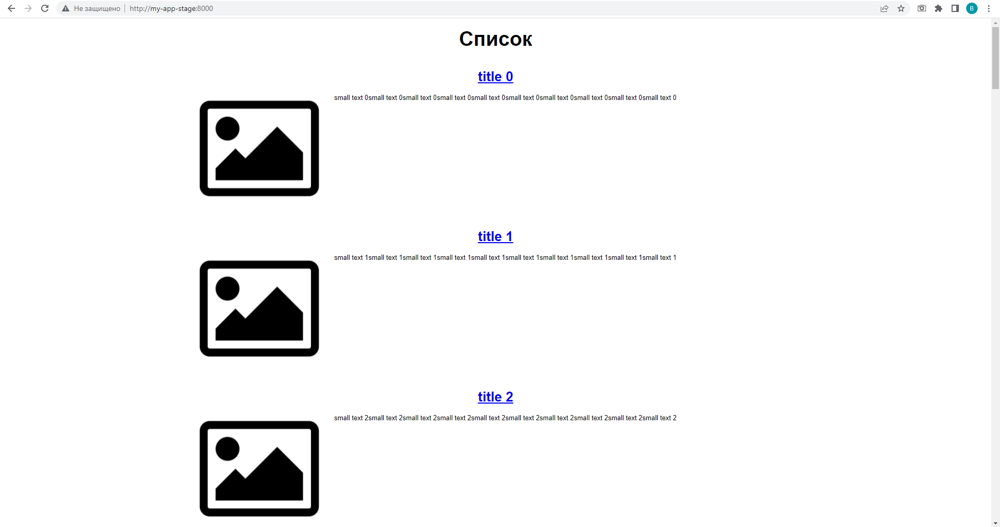

# Домашнее задание к занятию "13.1 контейнеры, поды, deployment, statefulset, services, endpoints"

Подготовка к заданию заключалась в том, что я скачал на докер-хост содержимое папки [13-kubernetes-config](https://github.com/netology-code/devkub-homeworks/tree/main/13-kubernetes-config), запустил сборку ```docker-compose up --build -d```,  загрузил полученные образы на hub.docker.com: [frontend](https://hub.docker.com/repository/docker/vovinet/13-kubernetes-config_frontend), [backend](https://hub.docker.com/repository/docker/vovinet/13-kubernetes-config_backend)

Затем написал [манифесты](manifests/stage/) и добился работоспособности для задания 1.

Чтобы наше приложение начало открываться, перезапускаем pod для инициализации БД с помощтю scale:
```
$ kubectl scale deployment my-app-stage --replicas=0
```

Вот что получилось:  
```
$ kubectl get po,pv,pvc,svc -o wide
NAME                         READY   STATUS    RESTARTS   AGE   IP             NODE    NOMINATED NODE   READINESS GATES
pod/db-stage-0               1/1     Running   0          35m   10.233.96.14   node2   <none>           <none>
pod/my-app-b44db4689-s4mvl   2/2     Running   0          19m   10.233.90.7    node1   <none>           <none>

NAME                                                        CAPACITY   ACCESS MODES   RECLAIM POLICY   STATUS   CLAIM                              STORAGECLASS        REASON   AGE    VOLUMEMODE
persistentvolume/my-app-stage-dbdata                        1Gi        RWO            Retain           Bound    my-app-stage/db-data-db-stage-0    my-app-stage-stor            3h5m   Filesystem
persistentvolume/pvc-d2fe02f0-9416-416e-bef2-ade70fa4d63e   100Mi      RWO            Delete           Bound    my-app/test-dynamic-volume-claim   nfs                          4d7h   Filesystem

NAME                                       STATUS   VOLUME                CAPACITY   ACCESS MODES   STORAGECLASS        AGE    VOLUMEMODE
persistentvolumeclaim/db-data-db-stage-0   Bound    my-app-stage-dbdata   1Gi        RWO            my-app-stage-stor   3h5m   Filesystem

NAME                   TYPE        CLUSTER-IP      EXTERNAL-IP   PORT(S)             AGE    SELECTOR
service/db-stage       ClusterIP   10.233.21.71    <none>        5432/TCP            3h5m   app=db-stage
service/my-app-stage   ClusterIP   10.233.30.213   <none>        8000/TCP,9000/TCP   3h5m   app=my-app
```
А так выглядит приложение в браузере:


## Задание 2.  
Переделал [манифесты](manifests/prod/) согласно заданию. Также создал внешний endpoint по заданию со *. После применения выглядит всё так:
```  
$ kubectl get po,pv,pvc,svc,sc,ep -o wide
NAME                                       READY   STATUS    RESTARTS   AGE   IP             NODE    NOMINATED NODE   READINESS GATES
pod/db-prod-0                              1/1     Running   0          30m   10.233.92.19   node3   <none>           <none>
pod/my-app-backend-prod-867c56c548-t6w7t   1/1     Running   0          30m   10.233.92.18   node3   <none>           <none>
pod/my-app-frontend-prod-b5c66cd78-v6m42   1/1     Running   0          26m   10.233.92.20   node3   <none>           <none>

NAME                                                        CAPACITY   ACCESS MODES   RECLAIM POLICY   STATUS   CLAIM                                  STORAGECLASS        REASON   AGE     VOLUMEMODE
persistentvolume/my-app-stage-dbdata                        1Gi        RWO            Retain           Bound    my-app-stage/db-data-db-stage-0        my-app-stage-stor            4h33m   Filesystem
persistentvolume/pvc-0889a599-ec6f-44e3-9fbd-df8b5a9c417a   5Gi        RWO            Delete           Bound    my-app-prod/my-app-db-prod-db-prod-0   csi-rbd-sc                   30m     Filesystem
persistentvolume/pvc-d2fe02f0-9416-416e-bef2-ade70fa4d63e   100Mi      RWO            Delete           Bound    my-app/test-dynamic-volume-claim       nfs                          4d8h    Filesystem

NAME                                             STATUS   VOLUME                                     CAPACITY   ACCESS MODES   STORAGECLASS   AGE   VOLUMEMODE
persistentvolumeclaim/my-app-db-prod-db-prod-0   Bound    pvc-0889a599-ec6f-44e3-9fbd-df8b5a9c417a   5Gi        RWO            csi-rbd-sc     30m   Filesystem

NAME                           TYPE        CLUSTER-IP      EXTERNAL-IP   PORT(S)    AGE   SELECTOR
service/db-prod                ClusterIP   10.233.43.102   <none>        5432/TCP   30m   app=my-app-db-prod
service/geocoder-svc           ClusterIP   10.233.53.138   <none>        80/TCP     14s   <none>
service/my-app-backend         ClusterIP   10.233.37.97    <none>        9000/TCP   29m   app=my-app-backend-prod
service/my-app-frontend-prod   ClusterIP   10.233.56.160   <none>        8000/TCP   30m   app=my-app-frontend-prod

NAME                                     PROVISIONER                                       RECLAIMPOLICY   VOLUMEBINDINGMODE   ALLOWVOLUMEEXPANSION   AGE
storageclass.storage.k8s.io/csi-rbd-sc   rbd.csi.ceph.com                                  Delete          Immediate           true                   49m
storageclass.storage.k8s.io/nfs          cluster.local/nfs-server-nfs-server-provisioner   Delete          Immediate           true                   4d8h

NAME                             ENDPOINTS           AGE
endpoints/db-prod                10.233.92.19:5432   30m
endpoints/geocoder-svc           52.202.62.77:80     14s
endpoints/my-app-backend         10.233.92.18:9000   29m
endpoints/my-app-frontend-prod   10.233.92.20:80     30m
```  
