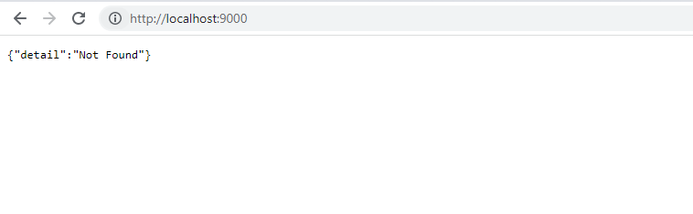
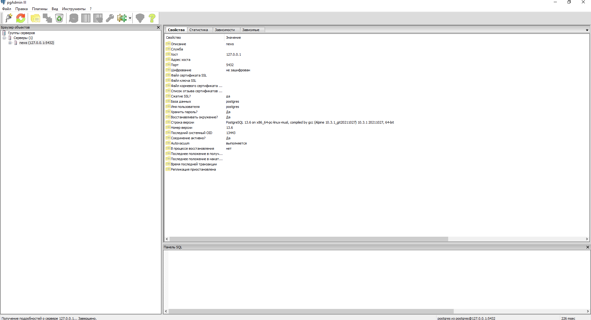

# Домашнее задание к занятию "13.3 работа с kubectl"  

## Задание 1  

Получим список наших подов:
```
$ kubectl get po -o wide
NAME                                    READY   STATUS    RESTARTS      AGE   IP             NODE    NOMINATED NODE   READINESS GATES
db-prod-0                               1/1     Running   1 (79m ago)   12h   10.233.92.25   node3   <none>           <none>
my-app-backend-prod-767d944b6d-xrldz    1/1     Running   0             37m   10.233.96.21   node2   <none>           <none>
my-app-frontend-prod-5c499fcf8b-n6q86   1/1     Running   0             37m   10.233.90.13   node1   <none>           <none>
nfs-server-nfs-server-provisioner-0     1/1     Running   0             38m   10.233.90.12   node1   <none>           <none>
```

Подключимся к pod бэкенда:
```
$ kubectl port-forward my-app-backend-prod-767d944b6d-xrldz 9000:9000
Forwarding from 127.0.0.1:9000 -> 9000
Forwarding from [::1]:9000 -> 9000
Handling connection for 9000
Handling connection for 9000
```

Обратимся к проброшенному порту с соседнего терминала:
```
$ curl http://localhost:9000
{"detail":"Not Found"}
```
или из браузера:



Теперь проверим frontend. Сам контейнер у нас слушает 80 порт, а сервис уже публикует 8000 порт.
```
$ kport-forward my-app-frontend-prod-5c499fcf8b-n6q86 8000:80
Forwarding from 127.0.0.1:8000 -> 80
Forwarding from [::1]:8000 -> 80
Handling connection for 8000
```
Проверяем в другом терминале:   
```
$ curl http://localhost:8000
<!DOCTYPE html>
<html lang="ru">
<head>
    <title>Список</title>
    <meta charset="UTF-8">
    <meta name="viewport" content="width=device-width, initial-scale=1.0">
    <link href="/build/main.css" rel="stylesheet">
</head>
<body>
    <main class="b-page">
        <h1 class="b-page__title">Список</h1>
        <div class="b-page__content b-items js-list"></div>
    </main>
    <script src="/build/main.js"></script>
</body>
</html>
```

Теперь тоже самое делаем через ```exec```:  

```
$ kubectexec -ti my-app-frontend-prod-5c499fcf8b-n6q86 -- bash -c "curl http://127.0.0.1:80"
<!DOCTYPE html>
<html lang="ru">
<head>
    <title>Список</title>
    <meta charset="UTF-8">
    <meta name="viewport" content="width=device-width, initial-scale=1.0">
    <link href="/build/main.css" rel="stylesheet">
</head>
<body>
    <main class="b-page">
        <h1 class="b-page__title">Список</h1>
        <div class="b-page__content b-items js-list"></div>
    </main>
    <script src="/build/main.js"></script>
</body>
</html>

$kubectl exec -ti my-app-backend-prod-767d944b6d-xrldz -- bash -c "curl http://127.0.0.1:9000"
{"detail":"Not Found"}

```

Подключимся к БД:
```
$ kubectl port-forward db-prod-0 5432:5432
Forwarding from 127.0.0.1:5432 -> 5432
Forwarding from [::1]:5432 -> 5432
Handling connection for 5432
Handling connection for 5432
```
Подключимся из cli:  
```
$ kubectl exec -ti db-prod-0 -- bash -c "psql -l -U postgres -W -h localhost"
Password:
                                 List of databases
   Name    |  Owner   | Encoding |  Collate   |   Ctype    |   Access privileges
-----------+----------+----------+------------+------------+-----------------------
 news      | postgres | UTF8     | en_US.utf8 | en_US.utf8 |
 postgres  | postgres | UTF8     | en_US.utf8 | en_US.utf8 |
 template0 | postgres | UTF8     | en_US.utf8 | en_US.utf8 | =c/postgres          +
           |          |          |            |            | postgres=CTc/postgres
 template1 | postgres | UTF8     | en_US.utf8 | en_US.utf8 | =c/postgres          +
           |          |          |            |            | postgres=CTc/postgres
(4 rows)
```
и клиентом:


## Задание 2: ручное масштабирование
```
$ kubectl scale deployment my-app-backend-prod --replicas=3
deployment.apps/my-app-backend-prod scaled
$ kubectl scale deployment my-app-frontend-prod --replicas=3
deployment.apps/my-app-frontend-prod scaled

$ kubectl get po -o wide
NAME                                    READY   STATUS    RESTARTS       AGE    IP             NODE    NOMINATED NODE   READINESS GATES
db-prod-0                               1/1     Running   1 (157m ago)   13h    10.233.92.25   node3   <none>           <none>
my-app-backend-prod-767d944b6d-sm9cm    1/1     Running   0              28s    10.233.92.29   node3   <none>           <none>
my-app-backend-prod-767d944b6d-t8llv    1/1     Running   0              28s    10.233.90.15   node1   <none>           <none>
my-app-backend-prod-767d944b6d-xrldz    1/1     Running   0              115m   10.233.96.21   node2   <none>           <none>
my-app-frontend-prod-5c499fcf8b-ck7qk   1/1     Running   0              22s    10.233.96.22   node2   <none>           <none>
my-app-frontend-prod-5c499fcf8b-fsm6p   1/1     Running   0              22s    10.233.92.30   node3   <none>           <none>
my-app-frontend-prod-5c499fcf8b-n6q86   1/1     Running   0              115m   10.233.90.13   node1   <none>           <none>
nfs-server-nfs-server-provisioner-0     1/1     Running   0              116m   10.233.90.12   node1   <none>           <none>

$ kubectl describe pod
Name:         db-prod-0
Namespace:    my-app-prod
Priority:     0
Node:         node3/10.10.10.23
Start Time:   Sun, 20 Feb 2022 23:55:06 +0300
Labels:       app=my-app-db-prod
              controller-revision-hash=db-prod-778bd496dd
              statefulset.kubernetes.io/pod-name=db-prod-0
Annotations:  cni.projectcalico.org/containerID: aa7730cc4b2a65f5530a6f6a13a0c48d3154c73aeeee9ed615feed8bfb4f5ea5
              cni.projectcalico.org/podIP: 10.233.92.25/32
              cni.projectcalico.org/podIPs: 10.233.92.25/32
Status:       Running
IP:           10.233.92.25
IPs:
  IP:           10.233.92.25
Controlled By:  StatefulSet/db-prod
Containers:
  db:
    Container ID:   containerd://1cbb7c4757b97f09453605597296c52485eb304ff9723335c1e73037b7c52f1f
    Image:          postgres:13-alpine
    Image ID:       docker.io/library/postgres@sha256:0e0f01c90dcc88b77b129dddb91631ee3dbcd1f6d48fe816a23e58cb4eec735a
    Port:           <none>
    Host Port:      <none>
    State:          Running
      Started:      Mon, 21 Feb 2022 11:11:38 +0300
    Last State:     Terminated
      Reason:       Unknown
      Exit Code:    255
      Started:      Sun, 20 Feb 2022 23:55:18 +0300
      Finished:     Mon, 21 Feb 2022 11:11:16 +0300
    Ready:          True
    Restart Count:  1
    Environment:
      POSTGRES_PASSWORD:  postgres
      POSTGRES_USER:      postgres
      POSTGRES_DB:        news
    Mounts:
      /var/db from my-app-db-prod (rw)
      /var/run/secrets/kubernetes.io/serviceaccount from kube-api-access-qrm4h (ro)
Conditions:
  Type              Status
  Initialized       True 
  Ready             True 
  ContainersReady   True 
  PodScheduled      True 
Volumes:
  my-app-db-prod:
    Type:       PersistentVolumeClaim (a reference to a PersistentVolumeClaim in the same namespace)
    ClaimName:  my-app-db-prod-db-prod-0
    ReadOnly:   false
  kube-api-access-qrm4h:
    Type:                    Projected (a volume that contains injected data from multiple sources)
    TokenExpirationSeconds:  3607
    ConfigMapName:           kube-root-ca.crt
    ConfigMapOptional:       <nil>
    DownwardAPI:             true
QoS Class:                   BestEffort
Node-Selectors:              <none>
Tolerations:                 node.kubernetes.io/not-ready:NoExecute op=Exists for 300s
                             node.kubernetes.io/unreachable:NoExecute op=Exists for 300s
Events:                      <none>


Name:         my-app-backend-prod-767d944b6d-sm9cm
Namespace:    my-app-prod
Priority:     0
Node:         node3/10.10.10.23
Start Time:   Mon, 21 Feb 2022 13:47:51 +0300
Labels:       app=my-app-backend-prod
              pod-template-hash=767d944b6d
Annotations:  cni.projectcalico.org/containerID: 3e9ae12479a8fe5746f184e9fd0aab33afa61742302c3603872f53441ab4027a
              cni.projectcalico.org/podIP: 10.233.92.29/32
              cni.projectcalico.org/podIPs: 10.233.92.29/32
Status:       Running
IP:           10.233.92.29
IPs:
  IP:           10.233.92.29
Controlled By:  ReplicaSet/my-app-backend-prod-767d944b6d
Containers:
  backend:
    Container ID:   containerd://d3e93c29e5e19eff7fb532b05675786296ad035f74e8bed6255797dc4878a9da
    Image:          vovinet/13-kubernetes-config_backend
    Image ID:       docker.io/vovinet/13-kubernetes-config_backend@sha256:c2a2a7c0f8207f5b36ced83547e1f7c2b290d1112ae0fff49c22eb80e5502be8
    Port:           <none>
    Host Port:      <none>
    State:          Running
      Started:      Mon, 21 Feb 2022 13:47:52 +0300
    Ready:          True
    Restart Count:  0
    Environment Variables from:
      cs-backend  ConfigMap  Optional: false
    Environment:  <none>
    Mounts:
      /static from static (rw)
      /var/run/secrets/kubernetes.io/serviceaccount from kube-api-access-7jg84 (ro)
Conditions:
  Type              Status
  Initialized       True 
  Ready             True 
  ContainersReady   True 
  PodScheduled      True 
Volumes:
  static:
    Type:       PersistentVolumeClaim (a reference to a PersistentVolumeClaim in the same namespace)
    ClaimName:  my-app-prod-pvc
    ReadOnly:   false
  kube-api-access-7jg84:
    Type:                    Projected (a volume that contains injected data from multiple sources)
    TokenExpirationSeconds:  3607
    ConfigMapName:           kube-root-ca.crt
    ConfigMapOptional:       <nil>
    DownwardAPI:             true
QoS Class:                   BestEffort
Node-Selectors:              <none>
Tolerations:                 node.kubernetes.io/not-ready:NoExecute op=Exists for 300s
                             node.kubernetes.io/unreachable:NoExecute op=Exists for 300s
Events:
  Type    Reason     Age   From               Message
  ----    ------     ----  ----               -------
  Normal  Scheduled  88s   default-scheduler  Successfully assigned my-app-prod/my-app-backend-prod-767d944b6d-sm9cm to node3
  Normal  Pulled     88s   kubelet            Container image "vovinet/13-kubernetes-config_backend" already present on machine
  Normal  Created    88s   kubelet            Created container backend
  Normal  Started    87s   kubelet            Started container backend


Name:         my-app-backend-prod-767d944b6d-t8llv
Namespace:    my-app-prod
Priority:     0
Node:         node1/10.10.10.21
Start Time:   Mon, 21 Feb 2022 13:47:51 +0300
Labels:       app=my-app-backend-prod
              pod-template-hash=767d944b6d
Annotations:  cni.projectcalico.org/containerID: 8188f4e698e4d3f7ff258c87945f13d626a1feb16fd77917f7994825c9c9e93f
              cni.projectcalico.org/podIP: 10.233.90.15/32
              cni.projectcalico.org/podIPs: 10.233.90.15/32
Status:       Running
IP:           10.233.90.15
IPs:
  IP:           10.233.90.15
Controlled By:  ReplicaSet/my-app-backend-prod-767d944b6d
Containers:
  backend:
    Container ID:   containerd://b0d932c77f265a1a1657bc81ca05735175cd1da60b6c9adf245bb41138f67f3b
    Image:          vovinet/13-kubernetes-config_backend
    Image ID:       docker.io/vovinet/13-kubernetes-config_backend@sha256:c2a2a7c0f8207f5b36ced83547e1f7c2b290d1112ae0fff49c22eb80e5502be8
    Port:           <none>
    Host Port:      <none>
    State:          Running
      Started:      Mon, 21 Feb 2022 13:47:52 +0300
    Ready:          True
    Restart Count:  0
    Environment Variables from:
      cs-backend  ConfigMap  Optional: false
    Environment:  <none>
    Mounts:
      /static from static (rw)
      /var/run/secrets/kubernetes.io/serviceaccount from kube-api-access-jjnqf (ro)
Conditions:
  Type              Status
  Initialized       True 
  Ready             True 
  ContainersReady   True 
  PodScheduled      True 
Volumes:
  static:
    Type:       PersistentVolumeClaim (a reference to a PersistentVolumeClaim in the same namespace)
    ClaimName:  my-app-prod-pvc
    ReadOnly:   false
  kube-api-access-jjnqf:
    Type:                    Projected (a volume that contains injected data from multiple sources)
    TokenExpirationSeconds:  3607
    ConfigMapName:           kube-root-ca.crt
    ConfigMapOptional:       <nil>
    DownwardAPI:             true
QoS Class:                   BestEffort
Node-Selectors:              <none>
Tolerations:                 node.kubernetes.io/not-ready:NoExecute op=Exists for 300s
                             node.kubernetes.io/unreachable:NoExecute op=Exists for 300s
Events:
  Type    Reason     Age   From               Message
  ----    ------     ----  ----               -------
  Normal  Scheduled  88s   default-scheduler  Successfully assigned my-app-prod/my-app-backend-prod-767d944b6d-t8llv to node1
  Normal  Pulled     88s   kubelet            Container image "vovinet/13-kubernetes-config_backend" already present on machine
  Normal  Created    88s   kubelet            Created container backend
  Normal  Started    87s   kubelet            Started container backend


Name:         my-app-backend-prod-767d944b6d-xrldz
Namespace:    my-app-prod
Priority:     0
Node:         node2/10.10.10.22
Start Time:   Mon, 21 Feb 2022 11:52:41 +0300
Labels:       app=my-app-backend-prod
              pod-template-hash=767d944b6d
Annotations:  cni.projectcalico.org/containerID: 6d784bfafb848751d4fadb9adb62091777d8daa6a0749963977aba2e8cdaa1cd
              cni.projectcalico.org/podIP: 10.233.96.21/32
              cni.projectcalico.org/podIPs: 10.233.96.21/32
Status:       Running
IP:           10.233.96.21
IPs:
  IP:           10.233.96.21
Controlled By:  ReplicaSet/my-app-backend-prod-767d944b6d
Containers:
  backend:
    Container ID:   containerd://b85c16f552ae3962d8c241f0711c357f273e4d4fd6b9599a778ebb508ebee1e9
    Image:          vovinet/13-kubernetes-config_backend
    Image ID:       docker.io/vovinet/13-kubernetes-config_backend@sha256:c2a2a7c0f8207f5b36ced83547e1f7c2b290d1112ae0fff49c22eb80e5502be8
    Port:           <none>
    Host Port:      <none>
    State:          Running
      Started:      Mon, 21 Feb 2022 11:52:42 +0300
    Ready:          True
    Restart Count:  0
    Environment Variables from:
      cs-backend  ConfigMap  Optional: false
    Environment:  <none>
    Mounts:
      /static from static (rw)
      /var/run/secrets/kubernetes.io/serviceaccount from kube-api-access-8xhq5 (ro)
Conditions:
  Type              Status
  Initialized       True 
  Ready             True 
  ContainersReady   True 
  PodScheduled      True 
Volumes:
  static:
    Type:       PersistentVolumeClaim (a reference to a PersistentVolumeClaim in the same namespace)
    ClaimName:  my-app-prod-pvc
    ReadOnly:   false
  kube-api-access-8xhq5:
    Type:                    Projected (a volume that contains injected data from multiple sources)
    TokenExpirationSeconds:  3607
    ConfigMapName:           kube-root-ca.crt
    ConfigMapOptional:       <nil>
    DownwardAPI:             true
QoS Class:                   BestEffort
Node-Selectors:              <none>
Tolerations:                 node.kubernetes.io/not-ready:NoExecute op=Exists for 300s
                             node.kubernetes.io/unreachable:NoExecute op=Exists for 300s
Events:                      <none>


Name:         my-app-frontend-prod-5c499fcf8b-ck7qk
Namespace:    my-app-prod
Priority:     0
Node:         node2/10.10.10.22
Start Time:   Mon, 21 Feb 2022 13:47:57 +0300
Labels:       app=my-app-frontend-prod
              pod-template-hash=5c499fcf8b
Annotations:  cni.projectcalico.org/containerID: ecb189903274dcb3d1b02b09233f286eee6ee8cb2eeb4cd462fda338fab1a963
              cni.projectcalico.org/podIP: 10.233.96.22/32
              cni.projectcalico.org/podIPs: 10.233.96.22/32
Status:       Running
IP:           10.233.96.22
IPs:
  IP:           10.233.96.22
Controlled By:  ReplicaSet/my-app-frontend-prod-5c499fcf8b
Containers:
  frontend:
    Container ID:   containerd://bebfd51e241b089d9b29208f15f00912708348e398df19b2543713c71d72e841
    Image:          vovinet/13-kubernetes-config_frontend
    Image ID:       docker.io/vovinet/13-kubernetes-config_frontend@sha256:6900c5bfd896b2d2f747fb40dd09b028430f63f2c9b27a8436f31a41203a7636
    Port:           <none>
    Host Port:      <none>
    State:          Running
      Started:      Mon, 21 Feb 2022 13:47:58 +0300
    Ready:          True
    Restart Count:  0
    Environment Variables from:
      cs-frontend  ConfigMap  Optional: false
    Environment:   <none>
    Mounts:
      /static from static (rw)
      /var/run/secrets/kubernetes.io/serviceaccount from kube-api-access-gcblz (ro)
Conditions:
  Type              Status
  Initialized       True 
  Ready             True 
  ContainersReady   True 
  PodScheduled      True 
Volumes:
  static:
    Type:       PersistentVolumeClaim (a reference to a PersistentVolumeClaim in the same namespace)
    ClaimName:  my-app-prod-pvc
    ReadOnly:   false
  kube-api-access-gcblz:
    Type:                    Projected (a volume that contains injected data from multiple sources)
    TokenExpirationSeconds:  3607
    ConfigMapName:           kube-root-ca.crt
    ConfigMapOptional:       <nil>
    DownwardAPI:             true
QoS Class:                   BestEffort
Node-Selectors:              <none>
Tolerations:                 node.kubernetes.io/not-ready:NoExecute op=Exists for 300s
                             node.kubernetes.io/unreachable:NoExecute op=Exists for 300s
Events:
  Type    Reason     Age   From               Message
  ----    ------     ----  ----               -------
  Normal  Scheduled  83s   default-scheduler  Successfully assigned my-app-prod/my-app-frontend-prod-5c499fcf8b-ck7qk to node2
  Normal  Pulled     83s   kubelet            Container image "vovinet/13-kubernetes-config_frontend" already present on machine
  Normal  Created    83s   kubelet            Created container frontend
  Normal  Started    82s   kubelet            Started container frontend


Name:         my-app-frontend-prod-5c499fcf8b-fsm6p
Namespace:    my-app-prod
Priority:     0
Node:         node3/10.10.10.23
Start Time:   Mon, 21 Feb 2022 13:47:57 +0300
Labels:       app=my-app-frontend-prod
              pod-template-hash=5c499fcf8b
Annotations:  cni.projectcalico.org/containerID: 88bafe8b5d5d48a313f55efa4073b2d361d68eea72ec73655cd560076f7be4e9
              cni.projectcalico.org/podIP: 10.233.92.30/32
              cni.projectcalico.org/podIPs: 10.233.92.30/32
Status:       Running
IP:           10.233.92.30
IPs:
  IP:           10.233.92.30
Controlled By:  ReplicaSet/my-app-frontend-prod-5c499fcf8b
Containers:
  frontend:
    Container ID:   containerd://9f89f03b45173ffedd85b7621625682d0787ddf5e8f23a3e0be9cc8750f52d2c
    Image:          vovinet/13-kubernetes-config_frontend
    Image ID:       docker.io/vovinet/13-kubernetes-config_frontend@sha256:6900c5bfd896b2d2f747fb40dd09b028430f63f2c9b27a8436f31a41203a7636
    Port:           <none>
    Host Port:      <none>
    State:          Running
      Started:      Mon, 21 Feb 2022 13:47:58 +0300
    Ready:          True
    Restart Count:  0
    Environment Variables from:
      cs-frontend  ConfigMap  Optional: false
    Environment:   <none>
    Mounts:
      /static from static (rw)
      /var/run/secrets/kubernetes.io/serviceaccount from kube-api-access-bmnjc (ro)
Conditions:
  Type              Status
  Initialized       True 
  Ready             True 
  ContainersReady   True 
  PodScheduled      True 
Volumes:
  static:
    Type:       PersistentVolumeClaim (a reference to a PersistentVolumeClaim in the same namespace)
    ClaimName:  my-app-prod-pvc
    ReadOnly:   false
  kube-api-access-bmnjc:
    Type:                    Projected (a volume that contains injected data from multiple sources)
    TokenExpirationSeconds:  3607
    ConfigMapName:           kube-root-ca.crt
    ConfigMapOptional:       <nil>
    DownwardAPI:             true
QoS Class:                   BestEffort
Node-Selectors:              <none>
Tolerations:                 node.kubernetes.io/not-ready:NoExecute op=Exists for 300s
                             node.kubernetes.io/unreachable:NoExecute op=Exists for 300s
Events:
  Type    Reason     Age   From               Message
  ----    ------     ----  ----               -------
  Normal  Scheduled  83s   default-scheduler  Successfully assigned my-app-prod/my-app-frontend-prod-5c499fcf8b-fsm6p to node3
  Normal  Pulled     82s   kubelet            Container image "vovinet/13-kubernetes-config_frontend" already present on machine
  Normal  Created    82s   kubelet            Created container frontend
  Normal  Started    82s   kubelet            Started container frontend


Name:         my-app-frontend-prod-5c499fcf8b-n6q86
Namespace:    my-app-prod
Priority:     0
Node:         node1/10.10.10.21
Start Time:   Mon, 21 Feb 2022 11:52:41 +0300
Labels:       app=my-app-frontend-prod
              pod-template-hash=5c499fcf8b
Annotations:  cni.projectcalico.org/containerID: 215b408b0e3a02db0b4dae69685082431c5c3d98e4b83a570a65811d9ad45abc
              cni.projectcalico.org/podIP: 10.233.90.13/32
              cni.projectcalico.org/podIPs: 10.233.90.13/32
Status:       Running
IP:           10.233.90.13
IPs:
  IP:           10.233.90.13
Controlled By:  ReplicaSet/my-app-frontend-prod-5c499fcf8b
Containers:
  frontend:
    Container ID:   containerd://8114b95a68c0162f2c2edad7db41dfd13f0013b16328e985b59ed0ab0dd34dda
    Image:          vovinet/13-kubernetes-config_frontend
    Image ID:       docker.io/vovinet/13-kubernetes-config_frontend@sha256:6900c5bfd896b2d2f747fb40dd09b028430f63f2c9b27a8436f31a41203a7636
    Port:           <none>
    Host Port:      <none>
    State:          Running
      Started:      Mon, 21 Feb 2022 11:52:42 +0300
    Ready:          True
    Restart Count:  0
    Environment Variables from:
      cs-frontend  ConfigMap  Optional: false
    Environment:   <none>
    Mounts:
      /static from static (rw)
      /var/run/secrets/kubernetes.io/serviceaccount from kube-api-access-fdrsg (ro)
Conditions:
  Type              Status
  Initialized       True 
  Ready             True 
  ContainersReady   True 
  PodScheduled      True 
Volumes:
  static:
    Type:       PersistentVolumeClaim (a reference to a PersistentVolumeClaim in the same namespace)
    ClaimName:  my-app-prod-pvc
    ReadOnly:   false
  kube-api-access-fdrsg:
    Type:                    Projected (a volume that contains injected data from multiple sources)
    TokenExpirationSeconds:  3607
    ConfigMapName:           kube-root-ca.crt
    ConfigMapOptional:       <nil>
    DownwardAPI:             true
QoS Class:                   BestEffort
Node-Selectors:              <none>
Tolerations:                 node.kubernetes.io/not-ready:NoExecute op=Exists for 300s
                             node.kubernetes.io/unreachable:NoExecute op=Exists for 300s
Events:                      <none>


Name:         nfs-server-nfs-server-provisioner-0
Namespace:    my-app-prod
Priority:     0
Node:         node1/10.10.10.21
Start Time:   Mon, 21 Feb 2022 11:51:47 +0300
Labels:       app=nfs-server-provisioner
              chart=nfs-server-provisioner-1.1.3
              controller-revision-hash=nfs-server-nfs-server-provisioner-64bd6d7f65
              heritage=Helm
              release=nfs-server
              statefulset.kubernetes.io/pod-name=nfs-server-nfs-server-provisioner-0
Annotations:  cni.projectcalico.org/containerID: 0f020cfba65c4ca5c1507e83c71d32a4db98e3e408ef0aa1766aab62b29020c7
              cni.projectcalico.org/podIP: 10.233.90.12/32
              cni.projectcalico.org/podIPs: 10.233.90.12/32
Status:       Running
IP:           10.233.90.12
IPs:
  IP:           10.233.90.12
Controlled By:  StatefulSet/nfs-server-nfs-server-provisioner
Containers:
  nfs-server-provisioner:
    Container ID:  containerd://5f6a7a62beefc81fc662796a85c20a6e939def0c8fa7626cae90ec40444df478
    Image:         quay.io/kubernetes_incubator/nfs-provisioner:v2.3.0
    Image ID:      quay.io/kubernetes_incubator/nfs-provisioner@sha256:f402e6039b3c1e60bf6596d283f3c470ffb0a1e169ceb8ce825e3218cd66c050
    Ports:         2049/TCP, 2049/UDP, 32803/TCP, 32803/UDP, 20048/TCP, 20048/UDP, 875/TCP, 875/UDP, 111/TCP, 111/UDP, 662/TCP, 662/UDP
    Host Ports:    0/TCP, 0/UDP, 0/TCP, 0/UDP, 0/TCP, 0/UDP, 0/TCP, 0/UDP, 0/TCP, 0/UDP, 0/TCP, 0/UDP
    Args:
      -provisioner=cluster.local/nfs-server-nfs-server-provisioner
    State:          Running
      Started:      Mon, 21 Feb 2022 11:51:48 +0300
    Ready:          True
    Restart Count:  0
    Environment:
      POD_IP:          (v1:status.podIP)
      SERVICE_NAME:   nfs-server-nfs-server-provisioner
      POD_NAMESPACE:  my-app-prod (v1:metadata.namespace)
    Mounts:
      /export from data (rw)
      /var/run/secrets/kubernetes.io/serviceaccount from kube-api-access-db9hn (ro)
Conditions:
  Type              Status
  Initialized       True 
  Ready             True 
  ContainersReady   True 
  PodScheduled      True 
Volumes:
  data:
    Type:       EmptyDir (a temporary directory that shares a pod's lifetime)
    Medium:     
    SizeLimit:  <unset>
  kube-api-access-db9hn:
    Type:                    Projected (a volume that contains injected data from multiple sources)
    TokenExpirationSeconds:  3607
    ConfigMapName:           kube-root-ca.crt
    ConfigMapOptional:       <nil>
    DownwardAPI:             true
QoS Class:                   BestEffort
Node-Selectors:              <none>
Tolerations:                 node.kubernetes.io/not-ready:NoExecute op=Exists for 300s
                             node.kubernetes.io/unreachable:NoExecute op=Exists for 300s
Events:                      <none>
```
